# mermaid2pptx 動作確認用: Flowchart 記法網羅（.mmd）

このファイルは公式ドキュメント（Flowchart Syntax）に載っている主要な記法を一通り通すためのテスト用です。  
https://mermaid.js.org/syntax/flowchart.html

---

## 1) graph / flowchart 宣言 + Direction（TB/TD/LR/RL/BT）

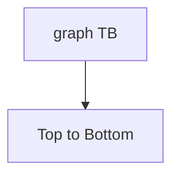

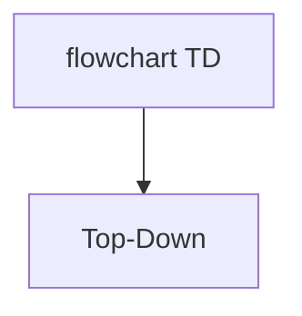

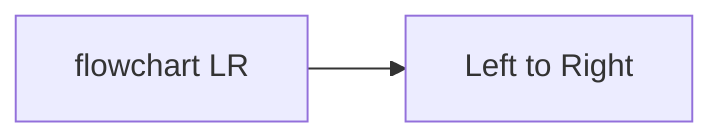

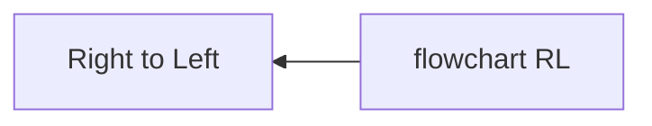

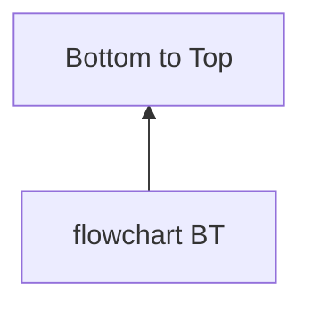

---

## 2) ノードID / テキスト / Unicode / Markdown（従来）

```mermaid
flowchart TD
  idOnly
  idWithText["表示テキスト（idと別）"]
  unicode["😄 Unicode は \" \" で囲む"]
  md["`**太字** と *斜体*`"]
  idOnly --> idWithText --> unicode --> md
```

---

## 3) Markdown Strings（自動折り返し + 改行 / 無効化）

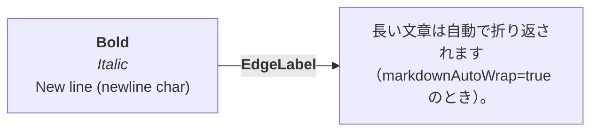

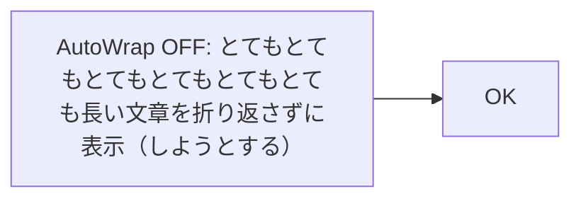

---

## 4) 旧来ノード形状（Node shapes）

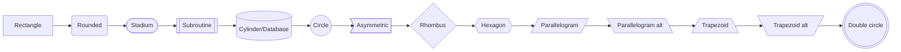

---

## 5) Expanded Node Shapes（v11.3.0+）: `@{ shape: ... }`

> 形状名（short name）を広く通すため、1つの図にまとめています。

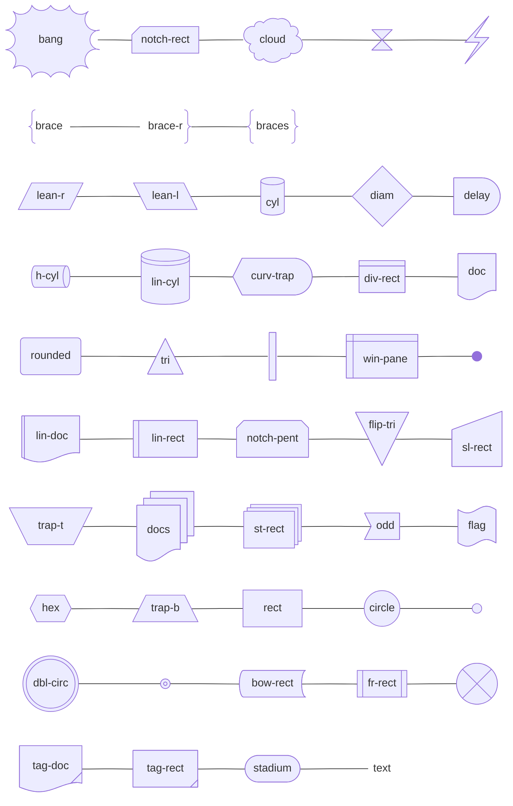

---

## 6) Special shapes（icon / image）

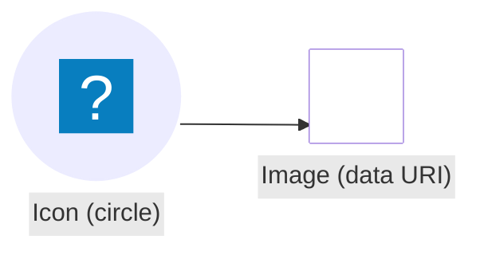

---

## 7) Links（矢印 / オープン / ラベル / 点線 / 太線 / 透明）

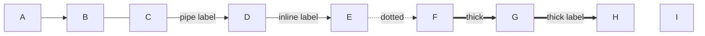

---

## 8) Chaining / Multiple node links（表現力の高い1行記法）

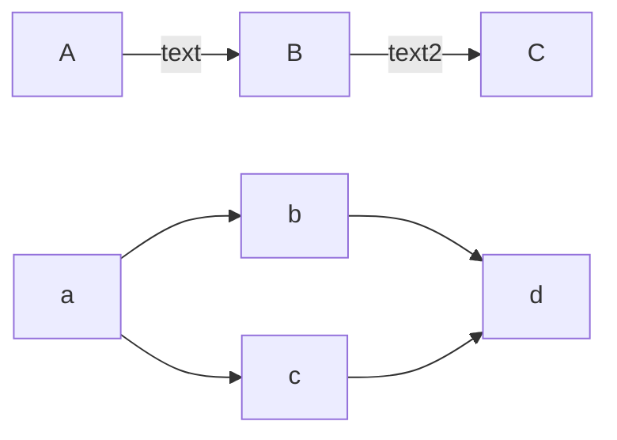

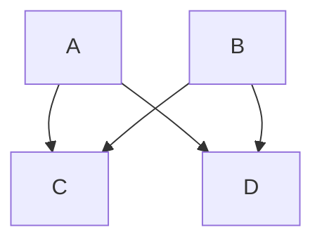

---

## 9) Edge IDs / Animation / classDef（edgeへclass適用）/ Edge curve override

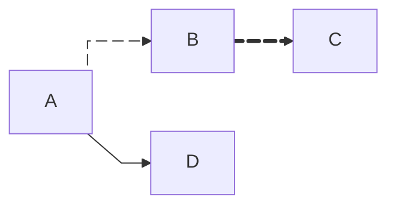

---

## 10) New arrow types（circle / cross） & Multi directional arrows

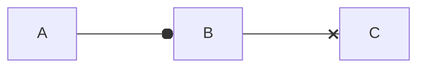

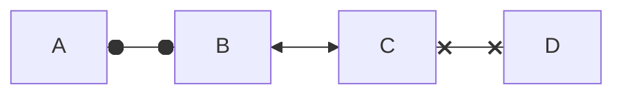

---

## 11) Minimum length of a link（ダッシュ追加）

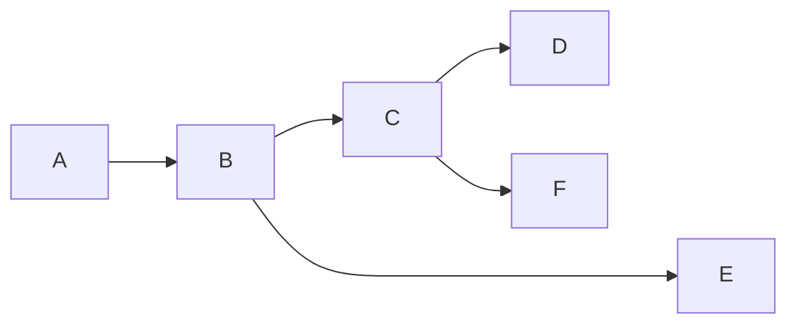

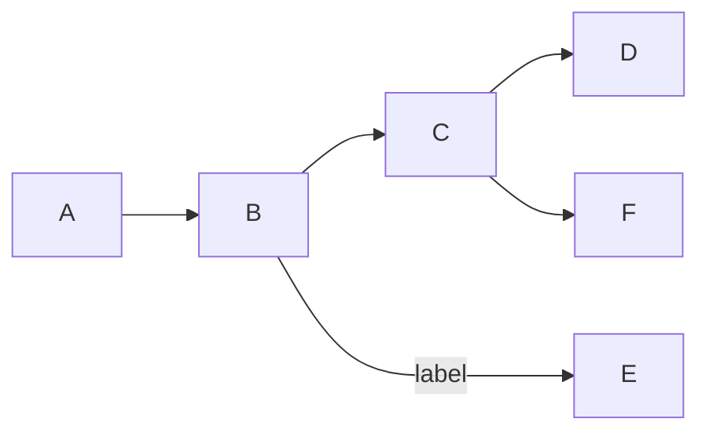

---

## 12) Special characters / Entity codes

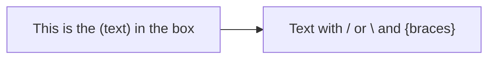

```mermaid
graph LR
  A["A double quote:#quot;"] --> B["A dec char:#9829;"]
```

---

## 13) Subgraphs（基本 / explicit id / subgraphと外部のリンク / subgraph内direction / limitation）

```mermaid
flowchart TB
  c1 --> a2
  subgraph one
    a1 --> a2
  end
```

```mermaid
flowchart TB
  c1 --> a2
  subgraph SG1[one (explicit id)]
    a1 --> a2
  end
```

```mermaid
flowchart TB
  subgraph SG
    a --> b
  end
  c --> SG
  SG --> d
```

```mermaid
flowchart TB
  subgraph outer
    direction LR
    x1 --> x2
    x2 --> x3
  end
```

```mermaid
flowchart TB
  %% Limitation: subgraph 内のノードが外部とリンクすると direction が親を継承
  subgraph outer
    direction LR
    y1 --> y2 --> y3
  end
  y2 --> outside
```

---

## 14) Comments（%%） / Styling（style, classDef, class, :::, linkStyle, default class）

```mermaid
flowchart LR
  %% コメントは %% で始まる「単独行」
  A[Normal] --> B[Styled]
  B --> C[Classed]
  C --> D[Default class]

  style B fill:#f9f,stroke:#333,stroke-width:4px

  classDef hot fill:#ff9,stroke:#333,stroke-width:4px
  class C hot

  classDef default fill:#eef,stroke:#333,stroke-width:2px

  %% linkStyle（0-based index）+ default
  linkStyle 1 stroke:#f00,stroke-width:4px,color:red
  linkStyle default stroke:#999
```

```mermaid
flowchart LR
  %% ::: 省略記法
  A:::hot --> B:::hot --> C
  classDef hot fill:#f96,stroke:#333,stroke-width:2px
```

---

## 15) Interaction（click）

```mermaid
flowchart LR
  A --> B --> C --> D
  click A callback "Tooltip"
  click B "https://www.github.com" "This is a link"
  click C call callback() "Tooltip"
  click D href "https://www.github.com" "This is a link" "_blank"
```

---

## 16) Graph declarations（スペース許容 / セミコロン省略）

```mermaid
graph LR;
  A[No space around label]-->B[OK];
  A --> C[Spaces between vertices and link]
  C --> D[No semicolon at end is OK]
```

---

## 17) Configuration（Renderer: elk）

```mermaid
---
config:
  flowchart:
    defaultRenderer: "elk"
---
flowchart LR
  A --> B --> C
```
